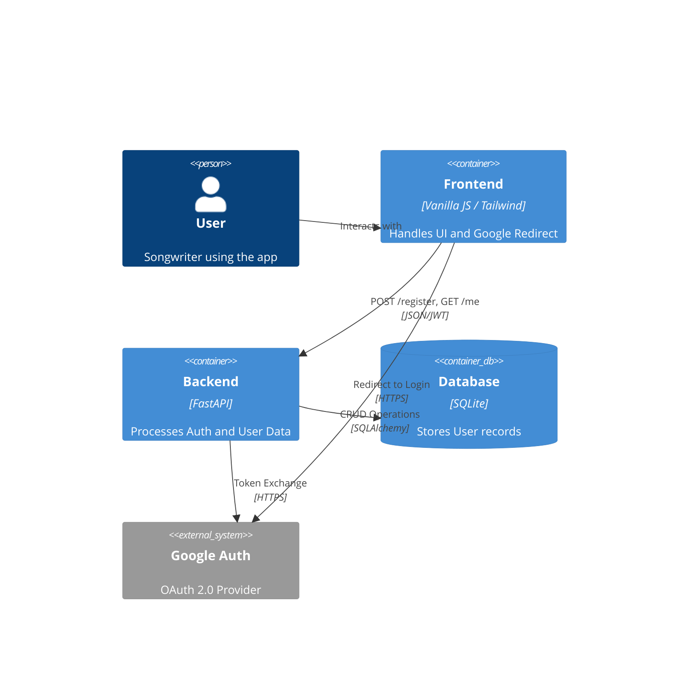

# Implementation Plan: User Registration & Google OAuth2

**Branch**: `00001-user-registration` | **Date**: 2026-05-03 | **Spec**: [specs/00001-user-registration/spec.md](specs/00001-user-registration/spec.md)

## Summary

**Goal**: Implement a user registration system with Google OAuth2 support and a dedicated registration page.  
**Approach**: Use FastAPI for the backend with `Authlib` for OAuth2 and `PyJWT` for sessions, storing users in a local SQLite database via `SQLAlchemy`.  
**Key Constraint**: Must integrate seamlessly with the existing Vanilla JS frontend without a full-blown framework like React.

## Technical Context

**Language/Version**: Python 3.14 (Backend), HTML5/JS (Frontend)  
**Primary Dependencies**: FastAPI, SQLAlchemy, Authlib, PyJWT, httpx  
**Storage**: SQLite  
**Testing**: pytest  
**Target Platform**: Local/Web  
**Project Type**: web  
**Project Mode**: brownfield  
**Performance Goals**: N/A (Low traffic prototype)  
**Constraints**: <500ms for auth responses  
**Scale/Scope**: Initial prototype

## Instructions Check

*GATE: Passed. Architecture follows modular FastAPI approach.*

## Architecture



## Architecture Decisions

| ID | Decision | Options Considered | Chosen | Rationale |
|----|----------|--------------------|--------|-----------|
| AD-001 | Auth Library | FastAPI Users / Authlib / Manual | Authlib | Provides the best balance of flexibility and ease of use for Google OAuth2. |
| AD-002 | Database ORM | Plain SQL / SQLAlchemy | SQLAlchemy | Simplifies migrations and user management in Python. |
| AD-003 | Session Management | Cookies / LocalStorage | JWT in LocalStorage | Easier to implement for a prototype with existing fetch calls. |

## Data Model Summary

| Entity | Key Fields | Relationships | Notes |
|--------|------------|---------------|-------|
| User | id, email, first_name, last_name, google_id | N/A | Unique index on email and google_id. |

**Detail**: `specs/00001-user-registration/data-model.md`

## API Surface Summary

| Method | Path | Purpose | Auth | Req/Res Types |
|--------|------|---------|------|---------------|
| POST | /register | Manual registration | None | UserSchema / TokenResponse |
| GET | /auth/google | OAuth start | None | Redirect |
| GET | /auth/google/callback | OAuth callback | None | Redirect |
| GET | /me | Current user info | JWT | UserSchema |

**Detail**: `specs/00001-user-registration/contracts/`

## Testing Strategy

| Tier | Tool | Scope | Mock Boundary | Install |
|------|------|-------|---------------|---------|
| Unit | pytest | User model & logic | Database (memory) | `pip install pytest` |
| Integration | httpx.AsyncClient | Auth endpoints | Google API (mocked) | `pip install httpx` |
| Security | bandit | Code analysis | — | `pip install bandit` |
| Coverage | pytest-cov | Test coverage | — | `pip install pytest-cov` |

## Error Handling Strategy

| Error Category | Pattern | Response | Retry |
|----------------|---------|----------|-------|
| Validation | fail-fast | 422 Unprocessable Entity | no |
| Conflict (Email) | fail-fast | 409 Conflict | no |
| Auth Failure | redirect | 302 Redirect to /registration?error=... | yes, manual |

## Integration Points

| Spec Reference | System/Service | Technical Approach | Contract |
|----------------|----------------|--------------------|----------|
| US2 | Google OAuth2 | Authorization Code Flow | [Google Docs](https://developers.google.com/identity/protocols/oauth2) |

## Risk Mitigation

| Risk (from spec) | Likelihood | Impact | Mitigation | Owner |
|-------------------|------------|--------|------------|-------|
| OAuth Complexity | M | H | Use Authlib and follow Google's standard flow. | Backend |
| Security | L | H | Secure JWT secrets in .env and use httpx-only logic where possible. | Backend |

## Requirement Coverage Map

| Req ID | Component(s) | File Path(s) | Notes |
|--------|--------------|--------------|-------|
| FR-001 | Frontend | + registration.html | New page |
| FR-002 | Frontend | + registration.html | Form fields |
| FR-003 | Frontend/Backend | ~ index.html, ~ backend.py | Regex validation |
| FR-004 | Backend | ~ backend.py | Authlib integration |
| FR-005 | Backend | ~ backend.py | SQL Unique constraint |
| TR-001 | Backend | ~ backend.py | FastAPI routes |
| TR-002 | Backend | + database.py | SQLAlchemy/SQLite |
| TR-003 | Backend | ~ backend.py | PyJWT logic |
| TR-004 | Backend | + database.py | User schema update |

## Project Structure

### Source Code

```text
~ backend.py (auth routes & middleware)
+ database.py (SQLAlchemy setup & User model)
~ index.html (add account icon & nav)
+ registration.html (registration form)
~ .env.example (add OAUTH vars)
```

**Patterns to reuse**: Existing `lifespan` pattern for `httpx.AsyncClient` in `backend.py`.
**Tests to extend**: New `tests/test_auth.py`.
**Naming conventions**: CamelCase for classes, snake_case for functions and variables.

## Implementation Hints

- **[HINT-001]** Order: Setup `database.py` and `User` model before implementing routes in `backend.py`.
- **[HINT-002]** Gotcha: Google OAuth2 `redirect_uri` must exactly match what's configured in the Google Console.
- **[HINT-003]** Compatibility: Ensure `registration.html` uses the same Tailwind/Google Fonts setup as `index.html`.
- **[HINT-004]** Constraint: Use `localStorage` for JWT to keep the frontend simple for this prototype.
