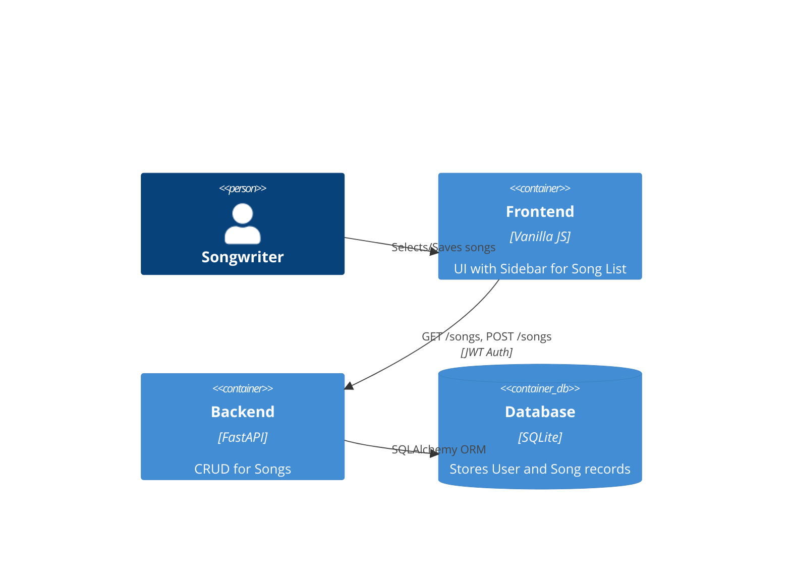

# Implementation Plan: Song Persistence

**Branch**: `00002-song-persistence` | **Date**: 2026-05-03 | **Spec**: [specs/00002-song-persistence/spec.md](specs/00002-song-persistence/spec.md)

## Summary

**Goal**: Implement a system to save and load user songs and their analysis results.  
**Approach**: Add a `Song` table to SQLite via SQLAlchemy, implement REST endpoints for CRUD, and add a "Library" sidebar to the frontend.  
**Key Constraint**: Must handle potentially large text fields (lyrics/analysis) efficiently in SQLite.

## Technical Context

**Language/Version**: Python 3.14, HTML5/JS  
**Primary Dependencies**: FastAPI, SQLAlchemy, PyJWT  
**Storage**: SQLite  
**Testing**: pytest  
**Target Platform**: Web  
**Project Type**: web  
**Project Mode**: brownfield

## Instructions Check

*GATE: Passed. Architecture extends existing multi-tenant user system.*

## Architecture



## Architecture Decisions

| ID | Decision | Options Considered | Chosen | Rationale |
|----|----------|--------------------|--------|-----------|
| AD-001 | Storage Format | JSON vs Flat Columns | Flat Columns | Easier to query and filter individual analysis parts if needed later. |
| AD-002 | Auto-save | Debounce vs Explicit Save | Explicit + Post-Analyze | Saves bandwidth; ensures data is persisted after every expensive AI run. |
| AD-003 | UI Integration | Modal vs Sidebar | Sidebar (Drawer) | Provides better quick-access experience while editing. |

## Data Model Summary

| Entity | Key Fields | Relationships | Notes |
|--------|------------|---------------|-------|
| Song | id, user_id, title, lyrics, analysis_data | User (N:1) | Primary key is UUID for cross-platform compatibility. |

**Detail**: `specs/00002-song-persistence/data-model.md`

## API Surface Summary

| Method | Path | Purpose | Auth | Req/Res Types |
|--------|------|---------|------|---------------|
| GET | /songs | List user songs | JWT | Array<SongShort> |
| POST | /songs | Create/Update song | JWT | SongFull / Status |
| GET | /songs/{id} | Load song details | JWT | SongFull |
| DELETE | /songs/{id} | Remove song | JWT | Status |

**Detail**: `specs/00002-song-persistence/contracts/`

## Testing Strategy

| Tier | Tool | Scope | Mock Boundary | Install |
|------|------|-------|---------------|---------|
| Unit | pytest | Song model logic | DB (memory) | `configured` |
| Integration | httpx | Song CRUD API | — | `configured` |
| Security | bandit | Path/Auth checks | — | `configured` |

## Error Handling Strategy

| Error Category | Pattern | Response | Retry |
|----------------|---------|----------|-------|
| Ownership | fail-fast | 403 Forbidden | no |
| Not Found | fail-fast | 404 Not Found | no |
| DB Error | log-alert | 500 Internal Error | yes, exponential |

## Risk Mitigation

| Risk (from spec) | Likelihood | Impact | Mitigation | Owner |
|-------------------|------------|--------|------------|-------|
| Data Loss | L | C | Use SQLAlchemy transactions and version checks. | Backend |
| UI Clutter | M | M | Use a collapsible sidebar with transition animations. | Frontend |

## Requirement Coverage Map

| Req ID | Component(s) | File Path(s) | Notes |
|--------|--------------|--------------|-------|
| FR-001 | Frontend/Backend | ~ index.html, ~ backend.py | Title field integration |
| FR-002 | Backend | ~ backend.py | JWT user_id extraction |
| FR-003 | Frontend | ~ index.html | Sidebar implementation |
| FR-004 | Backend | ~ backend.py | Delete route |
| FR-005 | Backend | ~ backend.py | Full result storage |
| TR-001 | Backend | ~ database.py | Song model |

## Project Structure

### Source Code

```text
~ database.py (add Song model)
~ backend.py (add song routes)
~ index.html (add sidebar UI & JS logic)
```

**Patterns to reuse**: Existing `Depends(get_db)` and `decode_access_token`.
**Naming conventions**: observed conventions (snake_case endpoints).

## Implementation Hints

- **[HINT-001]** Order: Add `Song` model and run `init_db()` before adding routes.
- **[HINT-002]** Constraint: Ensure `lyrics` field uses `Text` type in SQLAlchemy for large content.
- **[HINT-003]** Performance: Fetch only `id` and `title` for the initial list (GET /songs).
