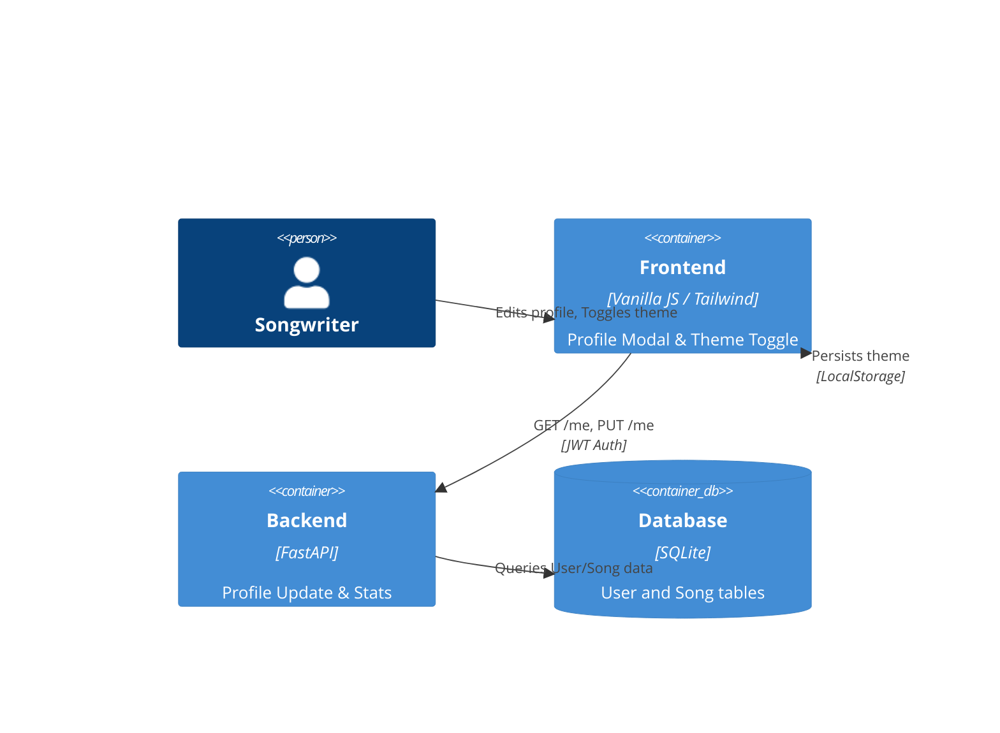

# Implementation Plan: User Profile & Settings

**Branch**: `00003-user-profile` | **Date**: 2026-05-03 | **Spec**: [specs/00003-user-profile/spec.md](specs/00003-user-profile/spec.md)

## Summary

**Goal**: Implement a user profile management system with name editing, song statistics, and a Dark Mode toggle.  
**Approach**: Extend the `/me` API to include statistics, add a `PUT /me` endpoint for updates, and implement a modal-based UI with theme persistence in `localStorage`.  
**Key Constraint**: Dark Mode must apply consistently across the Editor, Agent Pro, and Registration pages.

## Technical Context

**Language/Version**: Python 3.14, HTML5/JS  
**Primary Dependencies**: FastAPI, SQLAlchemy, Tailwind CSS  
**Storage**: SQLite, LocalStorage (for theme)  
**Testing**: pytest  
**Target Platform**: Web  

## Instructions Check

*GATE: Passed. Feature follows existing JWT-based auth and Tailwind styling.*

## Architecture



## Architecture Decisions

| ID | Decision | Options Considered | Chosen | Rationale |
|----|----------|--------------------|--------|-----------|
| AD-001 | Theme Strategy | CSS Variables vs Tailwind 'dark' | Tailwind 'dark' | Already integrated; allows easy class-based dark mode management. |
| AD-002 | UI Component | New Page vs Modal | Modal | Better for "Settings" flow; keeps the user context in the editor. |
| AD-003 | Stats Calculation | Real-time query vs Cached | Real-time query | Low complexity; song count is a simple `COUNT` query in SQLite. |

## Data Model Summary

No new tables. Existing `User` table fields will be updated via `PUT /me`.

## API Surface Summary

| Method | Path | Purpose | Auth | Req/Res Types |
|--------|------|---------|------|---------------|
| GET | /me | Fetch profile + stats | JWT | ProfileSchema |
| PUT | /me | Update name | JWT | UpdateSchema / Status |

**Detail**: `specs/00003-user-profile/contracts/profile.md`

## Testing Strategy

| Tier | Tool | Scope | Mock Boundary |
|------|------|-------|---------------|
| Unit | pytest | Profile update logic | DB (memory) |
| Integration | httpx | /me CRUD API | — |
| UI | Manual | Dark mode visual check | — |

## Error Handling Strategy

| Error Category | Pattern | Response | Retry |
|----------------|---------|----------|-------|
| Validation | fail-fast | 422 Unprocessable Entity | no |
| Auth | fail-fast | 401 Unauthorized | yes, login |

## Risk Mitigation

| Risk (from spec) | Likelihood | Impact | Mitigation | Owner |
|-------------------|------------|--------|------------|-------|
| Theme Inconsistency | M | L | Centralize theme logic in a shared script or header. | Frontend |
| Data Overwrite | L | M | Use specific fields in PATCH/PUT to avoid accidental changes. | Backend |

## Requirement Coverage Map

| Req ID | Component(s) | File Path(s) | Notes |
|--------|--------------|--------------|-------|
| FR-001 | Frontend | ~ index.html, ~ agent.html | Add Profile Modal |
| FR-002 | Backend/Frontend | ~ backend.py, ~ index.html | Edit name logic |
| FR-003 | Backend/Frontend | ~ backend.py, ~ index.html | Song count display |
| FR-004 | Frontend | ~ index.html, ~ agent.html | Theme toggle UI |
| FR-005 | Frontend | ~ index.html, ~ agent.html | theme storage logic |

## Project Structure

### Source Code

```text
~ backend.py (update /me, add PUT /me)
~ index.html (add profile modal & theme logic)
~ agent.html (add profile modal & theme logic)
```

## Implementation Hints

- **[HINT-001]** Use `document.documentElement.classList.toggle('dark', isDark)` for theme switching.
- **[HINT-002]** Ensure the "Account" icon opens the Profile Modal if logged in, instead of the registration page.
- **[HINT-003]** Add a "Sign Out" button inside the Profile Modal for better UX.
