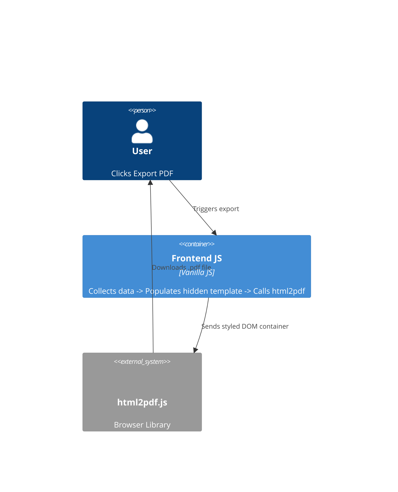

# Implementation Plan: Professional PDF Export

**Branch**: `00004-pdf-export` | **Date**: 2026-05-03 | **Spec**: [specs/00004-pdf-export/spec.md](specs/00004-pdf-export/spec.md)

## Summary

**Goal**: Enable users to export their lyrics and AI analysis results as high-quality, branded PDF documents.  
**Approach**: Integrate `html2pdf.js` for client-side rendering. Create a hidden, styled HTML template that populates data on-the-fly for clean PDF output.  
**Key Constraint**: The PDF must look professional (A4 format) and maintain branding regardless of the user's current theme (always light mode in PDF).

## Technical Context

**Primary Dependency**: `html2pdf.js` (via CDN)  
**Format**: PDF v1.4+ (A4 size)  
**Rendering**: Canvas-based conversion of DOM elements.  
**Styling**: Inline Tailwind CSS for the export template.

## Architecture



## Architecture Decisions

| ID | Decision | Chosen | Rationale |
|----|----------|--------|-----------|
| AD-001 | Generation Method | Client-side (html2pdf) | Zero server cost; instant feedback; easier to maintain styles. |
| AD-002 | Template Visibility | Hidden DIV | Prevents UI clutter while allowing complex CSS for the document. |
| AD-003 | Page Sizing | A4 (Portrait) | Standard for printed lyrics and reports. |

## Requirement Coverage Map

| Req ID | Component(s) | File Path(s) | Notes |
|--------|--------------|--------------|-------|
| FR-001 | Frontend | ~ index.html, ~ agent.html | Add "Export PDF" button |
| FR-002 | JS Logic | ~ index.html, ~ agent.html | Dynamic filename generation |
| FR-003 | HTML Template | ~ index.html, ~ agent.html | Hidden template including all sections |
| TR-001 | Library | ~ index.html, ~ agent.html | CDN script tag |

## Project Structure

### Source Code

```text
~ index.html (add template & pdf logic)
~ agent.html (add template & pdf logic)
```

## Implementation Hints

- **[HINT-001]** Theme: The PDF template should explicitly set `bg-white` and `text-slate-900` to avoid issues if the user is in Dark Mode.
- **[HINT-002]** Icons: Use SVG or text-based icons in PDF; standard Material Icons can sometimes fail to render if not fully loaded.
- **[HINT-003]** Scaling: Set `html2canvas: { scale: 2 }` in options for crisp text.
- **[HINT-004]** Page Breaks: Use CSS `page-break-after: always` if content is too long.
