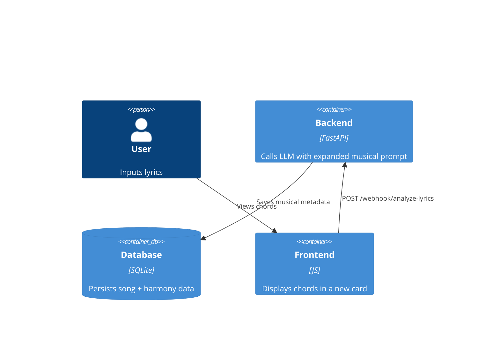

# Implementation Plan: AI Chord Assistant

**Branch**: `00005-chord-assistant` | **Date**: 2026-05-03 | **Spec**: [specs/00005-chord-assistant/spec.md](specs/00005-chord-assistant/spec.md)

## Summary

**Goal**: Provide AI-generated musical recommendations (key, BPM, chords) based on lyrics.  
**Approach**: Update the backend analysis prompt to return structured musical data, extend the SQLite database to persist these suggestions, and add a "Musical Harmony" card to the sidebar.  
**Key Constraint**: Recommendations must feel consistent with the detected mood of the lyrics.

## Technical Context

**Backend**: FastAPI, SQLAlchemy (SQLite), LLM (Magnum/Rocinante)  
**Frontend**: Vanilla JS, Tailwind CSS  
**Data Storage**: New columns in the `songs` table: `key`, `bpm`, `chords_verse`, `chords_chorus`.

## Architecture

## Architecture Decisions

| ID | Decision | Chosen | Rationale |
|----|----------|--------|-----------|
| AD-001 | Analysis Logic | Combined Analysis | Add music request to the existing `analyze-lyrics` webhook to minimize LLM calls and latency. |
| AD-002 | Data Format | Structured Fields | Store key, bpm, and chords as separate strings for easy display and future MIDI/Playback features. |
| AD-003 | UI Component | Sidebar Card | Consistent with the "Actionable Insights" design language. |

## Data Model Summary

| Table | Field | Type | Description |
|-------|-------|------|-------------|
| songs | musical_key | String | Suggested tonality (e.g., G Major) |
| songs | bpm | Integer | Suggested tempo |
| songs | chords_verse | Text | Chord sequence for verse |
| songs | chords_chorus | Text | Chord sequence for chorus |

## API Surface Summary

- **POST /webhook/analyze-lyrics**: Response will now include `musical_data`.
- **GET /songs/{id}**: Will return the new musical fields.
- **POST /songs**: Will accept and save the new musical fields.

## Requirement Coverage Map

| Req ID | Component | File | Notes |
|--------|-----------|------|-------|
| FR-001 | LLM Prompt | `backend.py` | Add chord request |
| FR-002 | LLM Prompt | `backend.py` | Add key/BPM request |
| FR-003 | Frontend | `index.html` | New "Harmony" card |
| FR-004 | PDF Template| `index.html` | Add music section |
| TR-002 | DB Schema | `database.py`| Add new columns |

## Implementation Hints

- **[HINT-001]** Use the `[HARMONY]` tag in the LLM prompt to extract structured music data cleanly.
- **[HINT-002]** Chords should be displayed in a monospace font for better readability.
- **[HINT-003]** Ensure `bpm` is parsed as an integer or a safe string to prevent UI errors.
